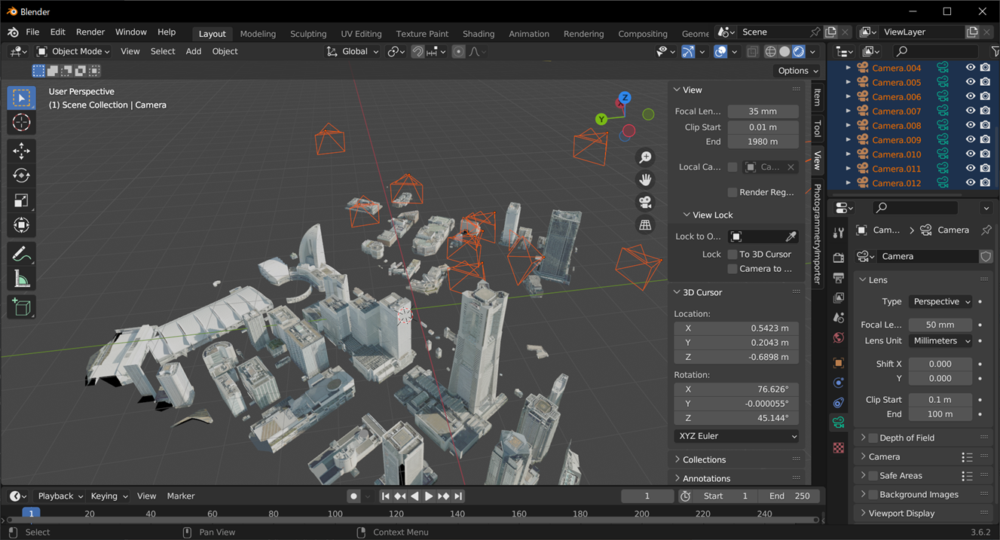
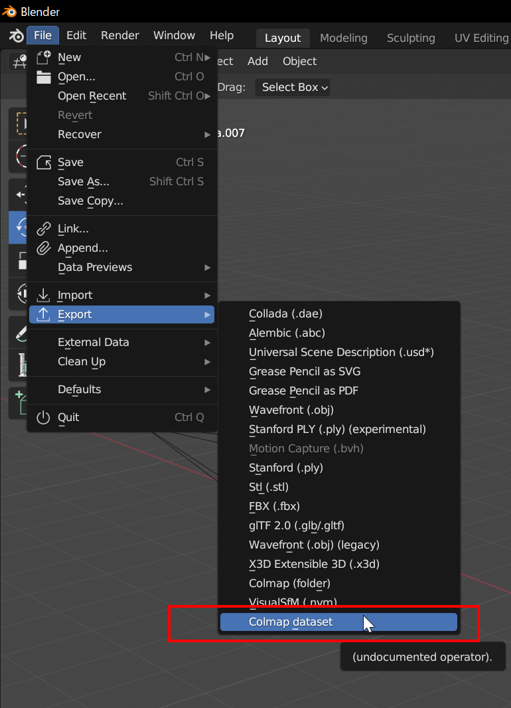
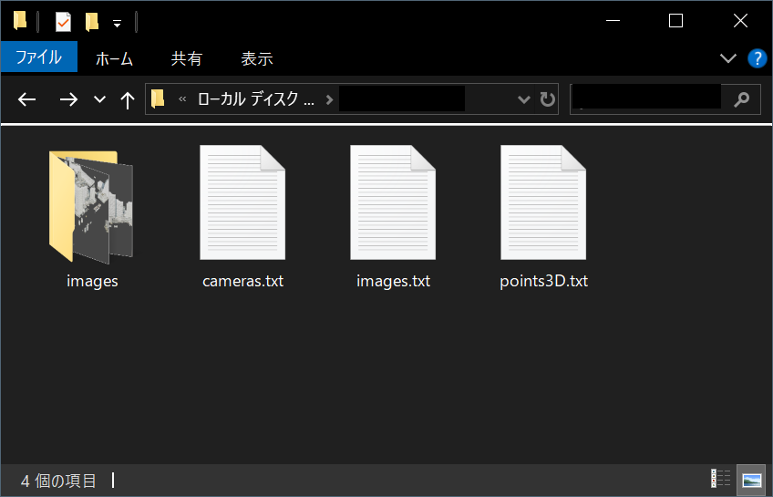
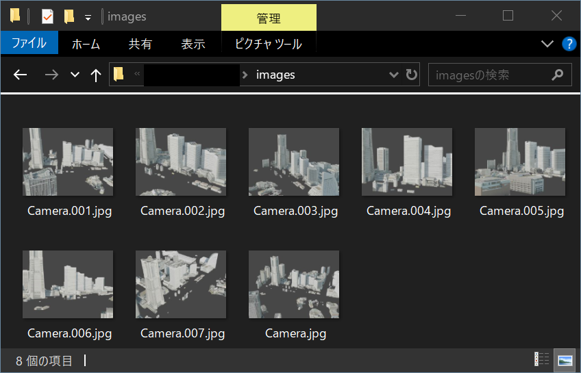

# blender-exporter-colmap

Blender plugin which generates a dataset for colmap by exporting blender camera poses and rendering scene.

## How to use

You can generate a dataset for colmap in below steps.

### 1. Place cameras on the scene

You can place cameras on the scene as you like.



### 2. Export your scene as dataset

From menu, execute this extension. ([File] -> [Export] -> [Colmap dataset])



### 3. You can get dataset for SfM

You can get cameras on scene exported as dataset on specified path. 



There are also images rendered with parameters and from the view point of camera in `images` folder.



## output format

This script generate these files on a selected folder.

|Name|Description|
|:--|:--|
|📂images|Contains rendered images. Each image is rendered with  parameters (intrinsic and pose) of camera in the scene.|
|📄cameras.txt|Contains intrinsic paramters of each camera.|
|📄images.txt|Contains camera poses of each camera.|
|📄points3D.txt|Empty file|

For details, please refer to [COLMAP documentation](https://colmap.github.io/format.html).

## How to use in colmap

You can use COLMAP cli for executing SfM with generated dataset.

```cmd
colmap feature_extractor --database_path "/path/to/output/database.db" --image_path "/path/to/dataset/images"

colmap exhaustive_matcher --database_path "/path/to/output/database.db" 

colmap point_triangulator --database_path "/path/to/output/database.db" --image_path "/path/to/dataset/images" --input_path "/path/to/dataset" --output_path "/path/to/output/triangulated/sparse/model"
```

Then, the result of 3d reconstruction is placed `/path/to/output/triangulated/sparse/model".